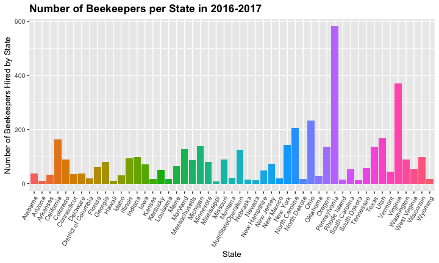
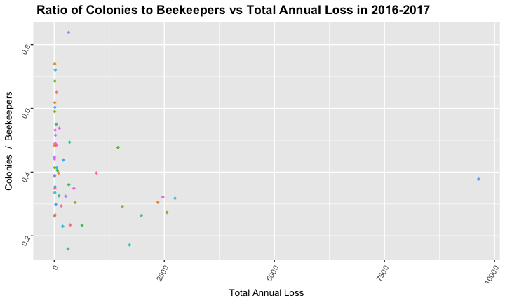

## Packages
We use the tidyverse and skimr for our project.

```r
#install.packages("skimr")
#install.packages("tidyverse")
library(tidyverse)
library(skimr)
library("RColorBrewer")
```

## Load the data
We found our data at the https://data.world/datasets/bees


##Rename the Data

```
## [1] "year"                "season"              "state"              
## [4] "totAnnualLoss"       "beekeepers"          "beekeepersExclusive"
## [7] "colonies"            "coloniesExclusive"
```


## How many bee colonies are there in each state?
<!-- -->

```
## <ggproto object: Class ScaleDiscrete, Scale, gg>
##     aesthetics: fill
##     axis_order: function
##     break_info: function
##     break_positions: function
##     breaks: waiver
##     call: call
##     clone: function
##     dimension: function
##     drop: TRUE
##     expand: waiver
##     get_breaks: function
##     get_breaks_minor: function
##     get_labels: function
##     get_limits: function
##     guide: legend
##     is_discrete: function
##     is_empty: function
##     labels: waiver
##     limits: NULL
##     make_sec_title: function
##     make_title: function
##     map: function
##     map_df: function
##     n.breaks.cache: NULL
##     na.translate: TRUE
##     na.value: NA
##     name: waiver
##     palette: function
##     palette.cache: NULL
##     position: left
##     range: <ggproto object: Class RangeDiscrete, Range, gg>
##         range: NULL
##         reset: function
##         train: function
##         super:  <ggproto object: Class RangeDiscrete, Range, gg>
##     reset: function
##     scale_name: brewer
##     train: function
##     train_df: function
##     transform: function
##     transform_df: function
##     super:  <ggproto object: Class ScaleDiscrete, Scale, gg>
```

## Colonies in 2016/2017
<!-- -->

```
## <ggproto object: Class ScaleDiscrete, Scale, gg>
##     aesthetics: fill
##     axis_order: function
##     break_info: function
##     break_positions: function
##     breaks: waiver
##     call: call
##     clone: function
##     dimension: function
##     drop: TRUE
##     expand: waiver
##     get_breaks: function
##     get_breaks_minor: function
##     get_labels: function
##     get_limits: function
##     guide: legend
##     is_discrete: function
##     is_empty: function
##     labels: waiver
##     limits: NULL
##     make_sec_title: function
##     make_title: function
##     map: function
##     map_df: function
##     n.breaks.cache: NULL
##     na.translate: TRUE
##     na.value: NA
##     name: waiver
##     palette: function
##     palette.cache: NULL
##     position: left
##     range: <ggproto object: Class RangeDiscrete, Range, gg>
##         range: NULL
##         reset: function
##         train: function
##         super:  <ggproto object: Class RangeDiscrete, Range, gg>
##     reset: function
##     scale_name: brewer
##     train: function
##     train_df: function
##     transform: function
##     transform_df: function
##     super:  <ggproto object: Class ScaleDiscrete, Scale, gg>
```


##Is it true bee colonies are losing?

```
## # A tibble: 53 x 3
##    year    state         totAnnualLoss
##    <chr>   <chr>                 <dbl>
##  1 2010/11 Maine                 0.869
##  2 2010/11 Georgia               0.847
##  3 2010/11 Michigan              0.835
##  4 2010/11 Iowa                  0.807
##  5 2010/11 West Virginia         0.786
##  6 2010/11 Pennsylvania          0.728
##  7 2010/11 New York              0.681
##  8 2010/11 Louisiana             0.636
##  9 2010/11 Massachusetts         0.607
## 10 2010/11 Illinois              0.583
## # … with 43 more rows
```

## Top 5 states with the highest colony loss in 2010
<!-- -->

##In the most recent year 2016-2017

```
## # A tibble: 51 x 3
##    year    state          totAnnualLoss
##    <chr>   <chr>                  <dbl>
##  1 2016/17 Oklahoma               0.839
##  2 2016/17 Delaware               0.74 
##  3 2016/17 Nebraska               0.721
##  4 2016/17 Iowa                   0.686
##  5 2016/17 Arizona                0.65 
##  6 2016/17 Connecticut            0.618
##  7 2016/17 New Hampshire          0.604
##  8 2016/17 Illinois               0.59 
##  9 2016/17 Maryland               0.55 
## 10 2016/17 South Carolina         0.538
## # … with 41 more rows
```

##Top 5 states with the highest colony loss in 2016
<!-- -->


##Average lossage of the colony in U.S.

```
## # A tibble: 7 x 2
##   year    mean_annualLoss
##   <chr>             <dbl>
## 1 2010/11           0.408
## 2 2011/12           0.342
## 3 2012/13           0.440
## 4 2013/14           0.402
## 5 2014/15           0.447
## 6 2015/16           0.424
## 7 2016/17           0.415
```

##Average Annual loss through out the year
<!-- -->


##BUT WHY ARE BEE COLONIES DESCREASING?
##Let's investigate one posible reason: Beekeepers

##Here's How Many Beekeepers Were Employed by Each State in 2016-2017
<!-- -->

##Pennsylvania and Virginia Are states with higher bee loss 
- Pennsylviania is ranked #16 in highest total annual bee loss
- Virginia is ranked #19

##There is no relationship between number of colonies and beekeepers
<!-- -->

##What really matters is the ratio of beekeepers to colonies, Right?

##But...
<!-- -->

##Furthermore...
<!-- -->

-Iowa and Oklahoma are two states with some of the highest total annual loss.

##On the other hand...
<!-- -->

-California and Massachusetts typically have a low total annual loss. 

-We can see that once again, there is no linear regression line


##Conclusion

The number of beekeepers being hired is not related to rising rates colony collapse. But here are some other factors that are likely to be:

- Pesticides, fungicides, and insecticides
- Bees' diets are not exactly healthy, but often consist of junk food in the form of sugar or corn syrup
- erratic weather patterns brought on by a changing climate

Source: https://www.motherjones.com/environment/2015/07/climate-change-killing-bumblebees/
http://sfyl.ifas.ufl.edu/agriculture/colony-collapse-disorder/

