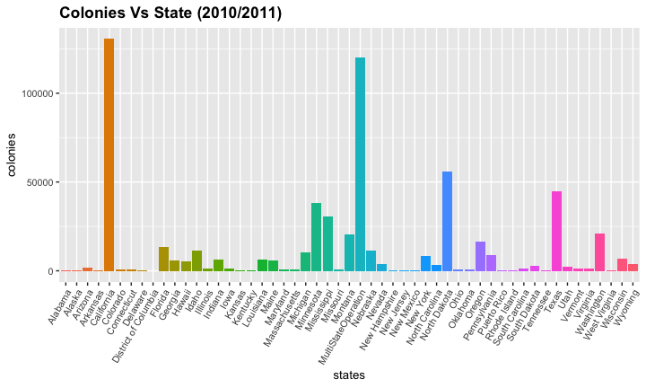
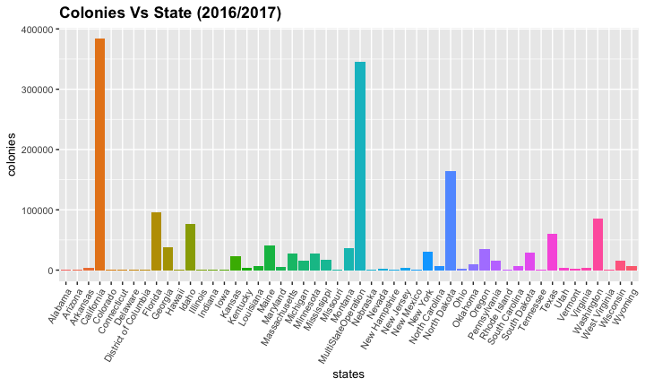
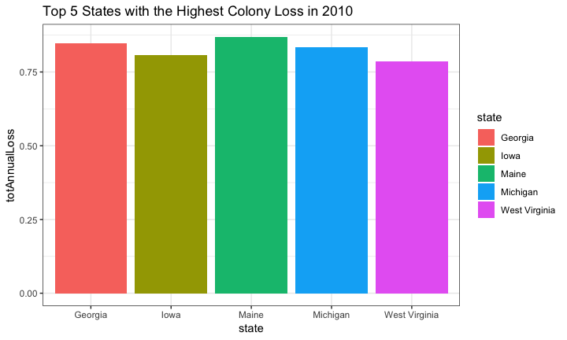
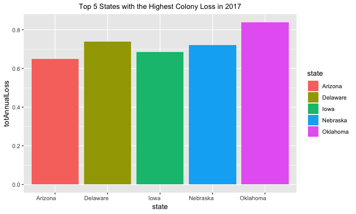
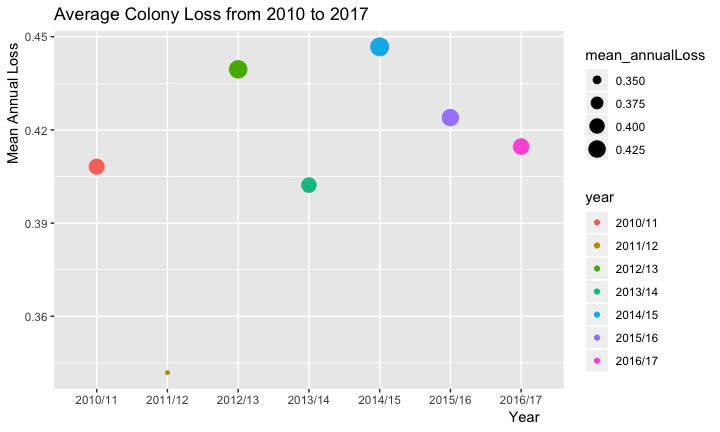
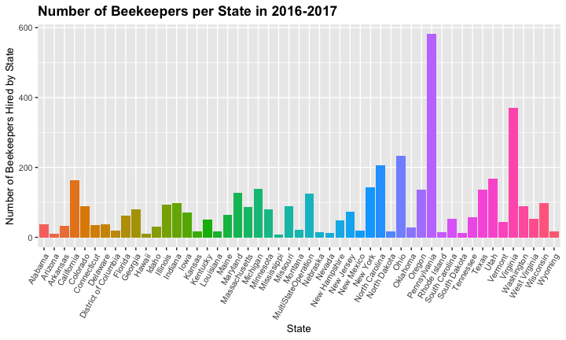
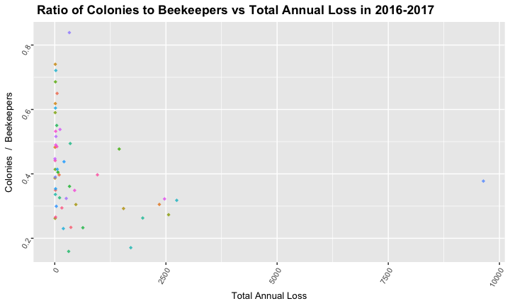
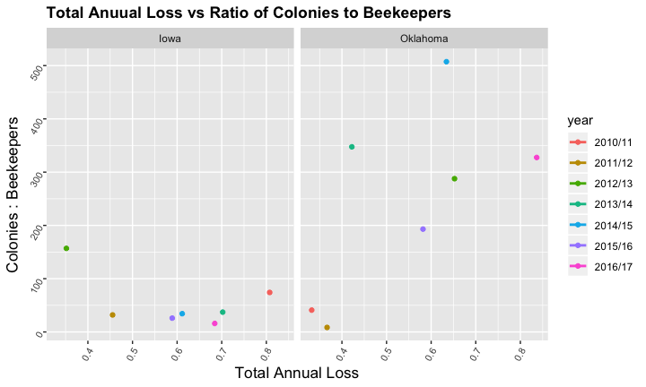
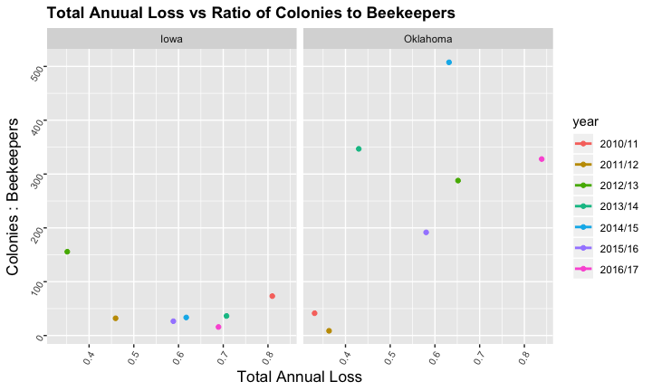
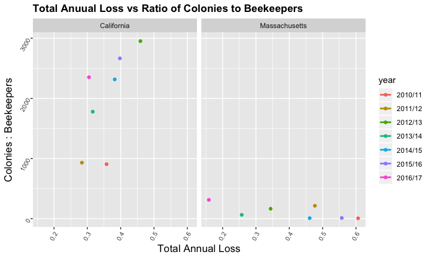

## Packages
We use the tidyverse and skimr for our project.

```r
#install.packages("skimr")
#install.packages("tidyverse")
library(tidyverse)
library(skimr)
library("RColorBrewer")
```


## Load the data
We found our data at the https://data.world/datasets/bees

```r
bee <- 
  readr::read_csv("/Users/clmuser/Desktop/Animals-master/Animals-master 5/bee2.csv")
bee
```

```
## # A tibble: 365 x 8
##    Year  Season State `Total Annual L… Beekeepers `Beekeepers Exc… Colonies
##    <chr> <chr>  <chr>            <dbl>      <dbl>            <dbl>    <dbl>
##  1 2016… Annual Mass…            0.159         87            0.943    27186
##  2 2016… Annual Mont…            0.171         21            0.524    35905
##  3 2016… Annual Neva…            0.23          13            0.923     2512
##  4 2016… Annual Maine            0.233         65            0.938    41102
##  5 2016… Annual Wyom…            0.234         18            0.778     6521
##  6 2016… Annual Hawa…            0.262         10            1           84
##  7 2016… Annual Miss…            0.263          9            0.222    17802
##  8 2016… Annual West…            0.266         52            0.942      993
##  9 2016… Annual Idaho            0.273         30            0.833    76794
## 10 2016… Annual Flor…            0.292         62            0.823    95872
## # … with 355 more rows, and 1 more variable: `Colonies Exclusive to
## #   State` <dbl>
```

##Rename the Data

```
## [1] "year"                "season"              "state"              
## [4] "totAnnualLoss"       "beekeepers"          "beekeepersExclusive"
## [7] "colonies"            "coloniesExclusive"
```


## How many bee colonies are there in each state?

<!-- -->

```
## <ggproto object: Class ScaleDiscrete, Scale, gg>
##     aesthetics: fill
##     axis_order: function
##     break_info: function
##     break_positions: function
##     breaks: waiver
##     call: call
##     clone: function
##     dimension: function
##     drop: TRUE
##     expand: waiver
##     get_breaks: function
##     get_breaks_minor: function
##     get_labels: function
##     get_limits: function
##     guide: legend
##     is_discrete: function
##     is_empty: function
##     labels: waiver
##     limits: NULL
##     make_sec_title: function
##     make_title: function
##     map: function
##     map_df: function
##     n.breaks.cache: NULL
##     na.translate: TRUE
##     na.value: NA
##     name: waiver
##     palette: function
##     palette.cache: NULL
##     position: left
##     range: <ggproto object: Class RangeDiscrete, Range, gg>
##         range: NULL
##         reset: function
##         train: function
##         super:  <ggproto object: Class RangeDiscrete, Range, gg>
##     reset: function
##     scale_name: brewer
##     train: function
##     train_df: function
##     transform: function
##     transform_df: function
##     super:  <ggproto object: Class ScaleDiscrete, Scale, gg>
```

## Colonies in 2016/2017
<!-- -->

```
## <ggproto object: Class ScaleDiscrete, Scale, gg>
##     aesthetics: fill
##     axis_order: function
##     break_info: function
##     break_positions: function
##     breaks: waiver
##     call: call
##     clone: function
##     dimension: function
##     drop: TRUE
##     expand: waiver
##     get_breaks: function
##     get_breaks_minor: function
##     get_labels: function
##     get_limits: function
##     guide: legend
##     is_discrete: function
##     is_empty: function
##     labels: waiver
##     limits: NULL
##     make_sec_title: function
##     make_title: function
##     map: function
##     map_df: function
##     n.breaks.cache: NULL
##     na.translate: TRUE
##     na.value: NA
##     name: waiver
##     palette: function
##     palette.cache: NULL
##     position: left
##     range: <ggproto object: Class RangeDiscrete, Range, gg>
##         range: NULL
##         reset: function
##         train: function
##         super:  <ggproto object: Class RangeDiscrete, Range, gg>
##     reset: function
##     scale_name: brewer
##     train: function
##     train_df: function
##     transform: function
##     transform_df: function
##     super:  <ggproto object: Class ScaleDiscrete, Scale, gg>
```


##Is it true bee colonies are losing?

```
## # A tibble: 53 x 8
##    year  season state totAnnualLoss beekeepers beekeepersExclu… colonies
##    <chr> <chr>  <chr>         <dbl>      <dbl>            <dbl>    <dbl>
##  1 2010… Annual Maine         0.869         43            0.93      5668
##  2 2010… Annual Geor…         0.847         61            0.967     5923
##  3 2010… Annual Mich…         0.835         99            0.97     10320
##  4 2010… Annual Iowa          0.807         14            0.857     1037
##  5 2010… Annual West…         0.786         25            0.92       509
##  6 2010… Annual Penn…         0.728        218            0.973     8640
##  7 2010… Annual New …         0.681         79            0.848     8197
##  8 2010… Annual Loui…         0.636         13            0.846     6153
##  9 2010… Annual Mass…         0.607         81            0.938      539
## 10 2010… Annual Illi…         0.583         57            0.947     1019
## # … with 43 more rows, and 1 more variable: coloniesExclusive <dbl>
```

## Top 5 states with the highest colony loss in 2010
<!-- -->

##In the most recent year 2016-2017

```
## # A tibble: 51 x 8
##    year  season state totAnnualLoss beekeepers beekeepersExclu… colonies
##    <chr> <chr>  <chr>         <dbl>      <dbl>            <dbl>    <dbl>
##  1 2016… Annual Okla…         0.839         29            0.965     9513
##  2 2016… Annual Dela…         0.74          38            0.868      462
##  3 2016… Annual Nebr…         0.721         15            0.933      355
##  4 2016… Annual Iowa          0.686         71            0.986     1074
##  5 2016… Annual Ariz…         0.65          10            0.8        528
##  6 2016… Annual Conn…         0.618         34            1          427
##  7 2016… Annual New …         0.604         49            0.939      757
##  8 2016… Annual Illi…         0.59          94            0.979      906
##  9 2016… Annual Mary…         0.55         127            0.905     5582
## 10 2016… Annual Sout…         0.538         53            0.943     6246
## # … with 41 more rows, and 1 more variable: coloniesExclusive <dbl>
```

##Top 5 states with the highest colony loss in 2016
<!-- -->


##Average lossage of the colony in U.S.

```
## # A tibble: 7 x 2
##   year    mean_annualLoss
##   <chr>             <dbl>
## 1 2010/11           0.408
## 2 2011/12           0.342
## 3 2012/13           0.440
## 4 2013/14           0.402
## 5 2014/15           0.447
## 6 2015/16           0.424
## 7 2016/17           0.415
```

##Average Annual loss through out the year
<!-- -->


##BUT WHY ARE BEE POPULATIONS DESCREASING?
##Let's investigate one posible reason: Beekeepers

##Here's How Many Beekeepers Were Employed by Each State in 2016-2017
<!-- -->

##Pennsylvania and Virginia Are states with higher bee loss 
- Pennsylviania is ranked #16 in highest total annual bee loss
- Virginia is ranked #19

```
## # A tibble: 51 x 8
##    year  season state totAnnualLoss beekeepers beekeepersExclu… colonies
##    <chr> <chr>  <chr>         <dbl>      <dbl>            <dbl>    <dbl>
##  1 2016… Annual Okla…         0.839         29            0.965     9513
##  2 2016… Annual Dela…         0.74          38            0.868      462
##  3 2016… Annual Nebr…         0.721         15            0.933      355
##  4 2016… Annual Iowa          0.686         71            0.986     1074
##  5 2016… Annual Ariz…         0.65          10            0.8        528
##  6 2016… Annual Conn…         0.618         34            1          427
##  7 2016… Annual New …         0.604         49            0.939      757
##  8 2016… Annual Illi…         0.59          94            0.979      906
##  9 2016… Annual Mary…         0.55         127            0.905     5582
## 10 2016… Annual Sout…         0.538         53            0.943     6246
## # … with 41 more rows, and 1 more variable: coloniesExclusive <dbl>
```

##There is no relationship between number of colonies and beekeepers
<!-- -->

##What really matters is the ratio of beekeepers to colonies, Right?

##But...
<!-- -->

##Furthermore...
<!-- -->

-Iowa and Oklahoma are two states with some of the highest total annual loss.

##On the other hand...
<!-- -->

-California and Massachusetts typically have a low total annual loss. 

-We can see that once again, there is no linear regression line


##Conclusion

The number of beekeepers being hired is not related to rising rates colony collapse. But here are some other factors that are likely to be:

- Pesticides, fungicides, and insecticides
- Bees' diets are not exactly healthy, but often consist of junk food in the form of sugar or corn syrup
- erratic weather patterns brought on by a changing climate

Source: <insert link to source here>.

