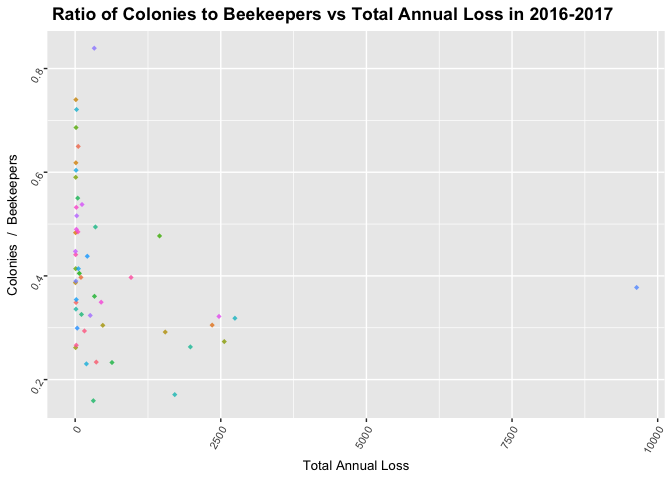

##Questions:
1. There’s a dataset in the folder called, “Bee colony Census Data by County”  and we wanted help in merging the data sets. 


2. Also in the “Bee colony Census Data by County” data set, there’s a column named “value” and we’ve looked in the glossary but we couldn’t find any info on it. We were wondering if you knew what we could use the “value” column for or if it’s even worth using anything in the ”Bee colony Census Data by County” data set. 

3. I'm having trouble geting all the columns in the object "bee2" Renamed. It seems like it won't recognize the variables original names even before I've renamed them. 


```r
#install.packages("tidyverse")
#install.packages("skimr")
#install.packages("RColorBrewer")
library("RColorBrewer")
library(tidyverse)
```

```
## ── Attaching packages ──────────────────────────── tidyverse 1.2.1 ──
```

```
## ✔ ggplot2 3.1.0       ✔ purrr   0.3.0  
## ✔ tibble  2.0.1       ✔ dplyr   0.8.0.1
## ✔ tidyr   0.8.2       ✔ stringr 1.4.0  
## ✔ readr   1.3.1       ✔ forcats 0.4.0
```

```
## Warning: package 'tibble' was built under R version 3.5.2
```

```
## Warning: package 'purrr' was built under R version 3.5.2
```

```
## Warning: package 'dplyr' was built under R version 3.5.2
```

```
## Warning: package 'stringr' was built under R version 3.5.2
```

```
## Warning: package 'forcats' was built under R version 3.5.2
```

```
## ── Conflicts ─────────────────────────────── tidyverse_conflicts() ──
## ✖ dplyr::filter() masks stats::filter()
## ✖ dplyr::lag()    masks stats::lag()
```

```r
library(skimr)
```

```
## Warning: package 'skimr' was built under R version 3.5.2
```

```
## 
## Attaching package: 'skimr'
```

```
## The following object is masked from 'package:stats':
## 
##     filter
```


```r
#if you guys are having trouble with viewing it, move the data to the same folder. ie move the rmd file to the finley data folder or move the excel sheet to the "animal-master" folder
bee <- 
  readr::read_csv("bee2.csv")
```

```
## Parsed with column specification:
## cols(
##   Year = col_character(),
##   Season = col_character(),
##   State = col_character(),
##   `Total Annual Loss` = col_double(),
##   Beekeepers = col_double(),
##   `Beekeepers Exclusive to State` = col_double(),
##   Colonies = col_double(),
##   `Colonies Exclusive to State` = col_double()
## )
```

```r
bee
```

```
## # A tibble: 365 x 8
##    Year  Season State `Total Annual L… Beekeepers `Beekeepers Exc… Colonies
##    <chr> <chr>  <chr>            <dbl>      <dbl>            <dbl>    <dbl>
##  1 2016… Annual Mass…            0.159         87            0.943    27186
##  2 2016… Annual Mont…            0.171         21            0.524    35905
##  3 2016… Annual Neva…            0.23          13            0.923     2512
##  4 2016… Annual Maine            0.233         65            0.938    41102
##  5 2016… Annual Wyom…            0.234         18            0.778     6521
##  6 2016… Annual Hawa…            0.262         10            1           84
##  7 2016… Annual Miss…            0.263          9            0.222    17802
##  8 2016… Annual West…            0.266         52            0.942      993
##  9 2016… Annual Idaho            0.273         30            0.833    76794
## 10 2016… Annual Flor…            0.292         62            0.823    95872
## # … with 355 more rows, and 1 more variable: `Colonies Exclusive to
## #   State` <dbl>
```

```r
names(bee)
```

```
## [1] "Year"                          "Season"                       
## [3] "State"                         "Total Annual Loss"            
## [5] "Beekeepers"                    "Beekeepers Exclusive to State"
## [7] "Colonies"                      "Colonies Exclusive to State"
```


```r
bee <- 
  bee %>% 
  dplyr::rename(
          year        = "Year",
          season      = "Season",
          state       = "State",
          totAnnualLoss = "Total Annual Loss",
          beekeepers = "Beekeepers",
          beekeepersExclusive = "Beekeepers Exclusive to State",
          colonies = "Colonies",
          coloniesExclusive =  "Colonies Exclusive to State" 
          )

names(bee)
```

```
## [1] "year"                "season"              "state"              
## [4] "totAnnualLoss"       "beekeepers"          "beekeepersExclusive"
## [7] "colonies"            "coloniesExclusive"
```

#Beekeepers in each state as graph

```r
bee %>% 
  filter(year=="2016/17") %>% 
  ggplot(aes(x=state, y= beekeepers, fill = state))+
  geom_col()+
  labs(title = "Number of Beekeepers per State in 2016-2017",
       x = "State",
       y = "Number of Beekeepers Hired by State")+
   theme( axis.text.x = element_text(angle = 60, hjust=1),
          axis.text=element_text(size=8),
          axis.title=element_text(size=10),
          legend.position="none",
          plot.title = element_text(lineheight=.8, face="bold"))
```

<!-- -->
#States with highest number of beekeeprs

```r
bee %>% 
  filter(year=="2016/17") %>% 
  arrange(desc(beekeepers))
```

```
## # A tibble: 51 x 8
##    year  season state totAnnualLoss beekeepers beekeepersExclu… colonies
##    <chr> <chr>  <chr>         <dbl>      <dbl>            <dbl>    <dbl>
##  1 2016… Annual Penn…         0.516        581            0.976    15517
##  2 2016… Annual Virg…         0.441        371            0.97      3263
##  3 2016… Annual Ohio          0.39         233            0.978     2717
##  4 2016… Annual Nort…         0.299        206            0.956     7246
##  5 2016… Annual Utah          0.532        167            0.97      3302
##  6 2016… Annual Cali…         0.305        163            0.632   383369
##  7 2016… Annual New …         0.438        143            0.923    29782
##  8 2016… Annual Mich…         0.326        138            0.964    14949
##  9 2016… Annual Oreg…         0.324        137            0.934    35433
## 10 2016… Annual Texas         0.349        136            0.927    60699
## # … with 41 more rows, and 1 more variable: coloniesExclusive <dbl>
```

#Interesting: Ohio

```r
bee %>% 
  filter(year=="2016/17") %>% 
  ggplot(aes(x=state, y= beekeepersExclusive, fill = state))+
  geom_col()+
  labs(title = "Percentage of Beekeepers Hired Exclusively by State in 2016-2017",
       x = "State",
       y = "Pecent of Exclusive Beekeepers Hired by State")+
   theme( axis.text.x = element_text(angle = 60, hjust=1),
          axis.text=element_text(size=8),
          axis.title=element_text(size=10),
          legend.position="none",
          plot.title = element_text(lineheight=.8, face="bold"))+
  scale_y_log10()+
  coord_flip()
```

```
## Warning: Transformation introduced infinite values in continuous y-axis
```

```
## Warning: Removed 1 rows containing missing values (geom_col).
```

<!-- -->
#graph indicating california trend in beekeeper stats

```r
bee %>% 
  filter(state=="California") %>% 
  ggplot(aes(x=beekeepers, y= colonies, color = year))+
  geom_jitter()+
  geom_smooth(method=lm, se=FALSE)+
  labs(title = "Number of Bee Colonies vs Number of Beekeepers",
       x = "Number of Beekeepers",
       y = "Number of Bee Colonies")+ 
   theme( axis.text.x = element_text(angle = 60, hjust=1),
          axis.text=element_text(size=8),
          axis.title=element_text(size=13),
          plot.title = element_text(lineheight=.8, face="bold"))
```

<!-- -->


```r
bee %>% 
  filter(year=="2016/17") %>% 
  arrange(desc(colonies))
```

```
## # A tibble: 51 x 8
##    year  season state totAnnualLoss beekeepers beekeepersExclu… colonies
##    <chr> <chr>  <chr>         <dbl>      <dbl>            <dbl>    <dbl>
##  1 2016… Annual Cali…         0.305        163            0.632   383369
##  2 2016… Annual Mult…         0.318        126            0       345567
##  3 2016… Annual Nort…         0.378         17            0.118   163861
##  4 2016… Annual Flor…         0.292         62            0.823    95872
##  5 2016… Annual Wash…         0.397         89            0.899    85387
##  6 2016… Annual Idaho         0.273         30            0.833    76794
##  7 2016… Annual Texas         0.349        136            0.927    60699
##  8 2016… Annual Maine         0.233         65            0.938    41102
##  9 2016… Annual Geor…         0.305         81            0.877    38443
## 10 2016… Annual Mont…         0.171         21            0.524    35905
## # … with 41 more rows, and 1 more variable: coloniesExclusive <dbl>
```


```r
bee %>% 
  filter(year=="2016/17") %>% 
  arrange(desc(totAnnualLoss))
```

```
## # A tibble: 51 x 8
##    year  season state totAnnualLoss beekeepers beekeepersExclu… colonies
##    <chr> <chr>  <chr>         <dbl>      <dbl>            <dbl>    <dbl>
##  1 2016… Annual Okla…         0.839         29            0.965     9513
##  2 2016… Annual Dela…         0.74          38            0.868      462
##  3 2016… Annual Nebr…         0.721         15            0.933      355
##  4 2016… Annual Iowa          0.686         71            0.986     1074
##  5 2016… Annual Ariz…         0.65          10            0.8        528
##  6 2016… Annual Conn…         0.618         34            1          427
##  7 2016… Annual New …         0.604         49            0.939      757
##  8 2016… Annual Illi…         0.59          94            0.979      906
##  9 2016… Annual Mary…         0.55         127            0.905     5582
## 10 2016… Annual Sout…         0.538         53            0.943     6246
## # … with 41 more rows, and 1 more variable: coloniesExclusive <dbl>
```

```r
bee %>% 
  filter(year=="2016/17") %>% 
  arrange(totAnnualLoss)
```

```
## # A tibble: 51 x 8
##    year  season state totAnnualLoss beekeepers beekeepersExclu… colonies
##    <chr> <chr>  <chr>         <dbl>      <dbl>            <dbl>    <dbl>
##  1 2016… Annual Mass…         0.159         87            0.943    27186
##  2 2016… Annual Mont…         0.171         21            0.524    35905
##  3 2016… Annual Neva…         0.23          13            0.923     2512
##  4 2016… Annual Maine         0.233         65            0.938    41102
##  5 2016… Annual Wyom…         0.234         18            0.778     6521
##  6 2016… Annual Hawa…         0.262         10            1           84
##  7 2016… Annual Miss…         0.263          9            0.222    17802
##  8 2016… Annual West…         0.266         52            0.942      993
##  9 2016… Annual Idaho         0.273         30            0.833    76794
## 10 2016… Annual Flor…         0.292         62            0.823    95872
## # … with 41 more rows, and 1 more variable: coloniesExclusive <dbl>
```


```r
bee %>% 
  filter(year=="2016/17") %>% 
  arrange(desc(beekeepers))
```

```
## # A tibble: 51 x 8
##    year  season state totAnnualLoss beekeepers beekeepersExclu… colonies
##    <chr> <chr>  <chr>         <dbl>      <dbl>            <dbl>    <dbl>
##  1 2016… Annual Penn…         0.516        581            0.976    15517
##  2 2016… Annual Virg…         0.441        371            0.97      3263
##  3 2016… Annual Ohio          0.39         233            0.978     2717
##  4 2016… Annual Nort…         0.299        206            0.956     7246
##  5 2016… Annual Utah          0.532        167            0.97      3302
##  6 2016… Annual Cali…         0.305        163            0.632   383369
##  7 2016… Annual New …         0.438        143            0.923    29782
##  8 2016… Annual Mich…         0.326        138            0.964    14949
##  9 2016… Annual Oreg…         0.324        137            0.934    35433
## 10 2016… Annual Texas         0.349        136            0.927    60699
## # … with 41 more rows, and 1 more variable: coloniesExclusive <dbl>
```


```r
bee %>% 
  filter(year=="2016/17") %>% 
  arrange(desc(beekeepersExclusive))
```

```
## # A tibble: 51 x 8
##    year  season state totAnnualLoss beekeepers beekeepersExclu… colonies
##    <chr> <chr>  <chr>         <dbl>      <dbl>            <dbl>    <dbl>
##  1 2016… Annual Hawa…         0.262         10            1           84
##  2 2016… Annual Indi…         0.414         99            1          952
##  3 2016… Annual Tenn…         0.49          57            1         1199
##  4 2016… Annual Conn…         0.618         34            1          427
##  5 2016… Annual Iowa          0.686         71            0.986     1074
##  6 2016… Annual Illi…         0.59          94            0.979      906
##  7 2016… Annual Ohio          0.39         233            0.978     2717
##  8 2016… Annual Penn…         0.516        581            0.976    15517
##  9 2016… Annual Alab…         0.349         38            0.974      573
## 10 2016… Annual Virg…         0.441        371            0.97      3263
## # … with 41 more rows, and 1 more variable: coloniesExclusive <dbl>
```
#seeing Which States have the highest number of colonies per beekeeper

```r
bee %>%
  mutate(coloniesPerKeeper = colonies/beekeepers) %>% 
  filter(year=="2016/17") %>% 
  arrange(desc(coloniesPerKeeper))
```

```
## # A tibble: 51 x 9
##    year  season state totAnnualLoss beekeepers beekeepersExclu… colonies
##    <chr> <chr>  <chr>         <dbl>      <dbl>            <dbl>    <dbl>
##  1 2016… Annual Nort…         0.378         17            0.118   163861
##  2 2016… Annual Mult…         0.318        126            0       345567
##  3 2016… Annual Idaho         0.273         30            0.833    76794
##  4 2016… Annual Sout…         0.322         12            0.5      29626
##  5 2016… Annual Cali…         0.305        163            0.632   383369
##  6 2016… Annual Miss…         0.263          9            0.222    17802
##  7 2016… Annual Mont…         0.171         21            0.524    35905
##  8 2016… Annual Flor…         0.292         62            0.823    95872
##  9 2016… Annual Kans…         0.477         16            0.938    23181
## 10 2016… Annual Wash…         0.397         89            0.899    85387
## # … with 41 more rows, and 2 more variables: coloniesExclusive <dbl>,
## #   coloniesPerKeeper <dbl>
```

```r
bee %>% 
  mutate(coloniesPerKeeper = colonies/beekeepers) %>% 
  filter(year=="2016/17") %>% 
  ggplot(aes(x=totAnnualLoss, y= coloniesPerKeeper, color=state))+
  geom_jitter()+
  geom_smooth(method=lm, se=FALSE)+
  labs(title = "Ratio of Colonies:Beekeepers vs Total Annual Loss in 2016-2017",
       x = "Total Annual Loss",
       y = "Ratio of Colonies to Beekeepers")+
   theme( axis.text.x = element_text(angle = 60, hjust=1),
          axis.text=element_text(size=8),
          axis.title=element_text(size=10),
          plot.title = element_text(lineheight=.8, face="bold"))
```

<!-- -->


```r
bee %>% 
  mutate(coloniesPerKeeper = colonies/beekeepers) %>% 
  filter(state == "Oklahoma") %>% 
  ggplot(aes(x=totAnnualLoss, y= coloniesPerKeeper, fill = year))+
  geom_col()+
  labs(title = "Ratio of Colonies:Beekeepers vs Total Annual Loss in Oklahoma",
       x = "Total Annual Loss",
       y = "Ratio of Colonies to Beekeepers")+
   theme( axis.text.x = element_text(angle = 60, hjust=1),
          axis.text=element_text(size=8),
          axis.title=element_text(size=10),
          legend.position="none",
          plot.title = element_text(lineheight=0.8, face="bold"))+
  facet_grid(. ~ year)+
  scale_fill_brewer(palette = "Dark2")
```

<!-- -->


#Main Takeway: Total Annual Bee Loss isn't dependent on the number of beekeepers. For example Mississippi and California have some of the higest ratios of colonies:beekeepers yet still have lower total annual loss values compared to some states like Oklahoma, which has the highest total annual loss for the most recent year and has one of the lowest colony:keeper ratios out there. 
